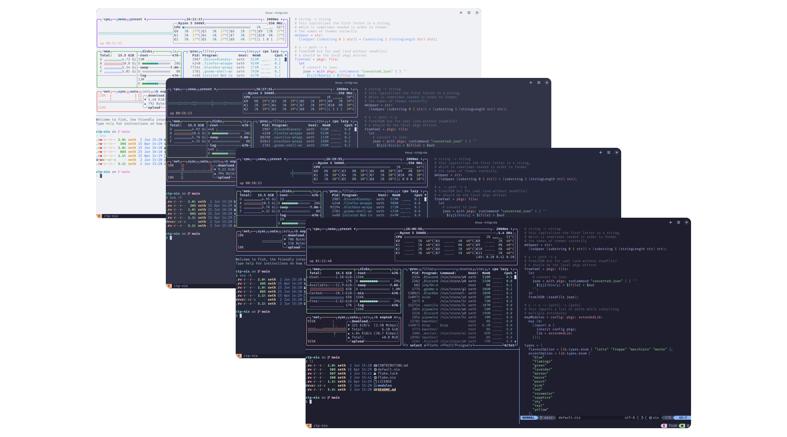
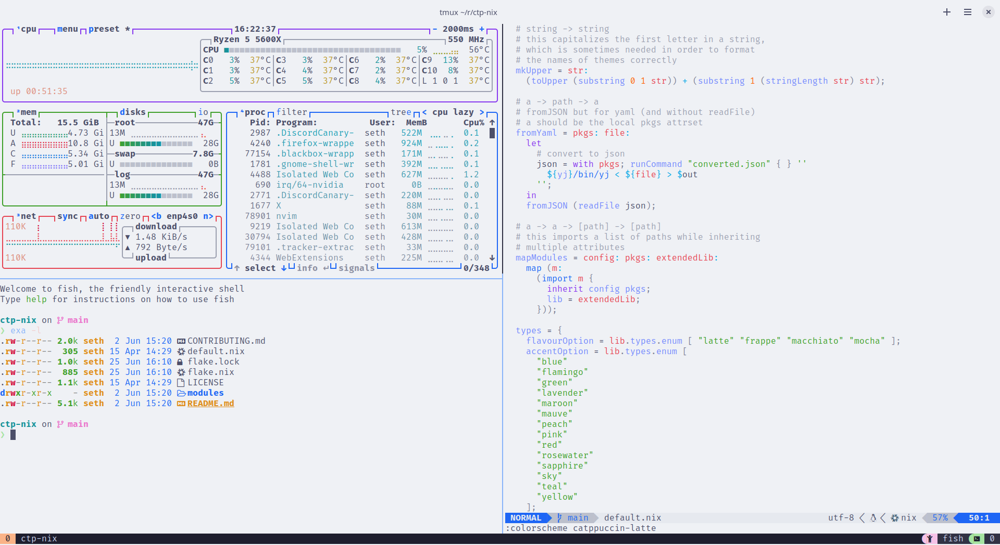
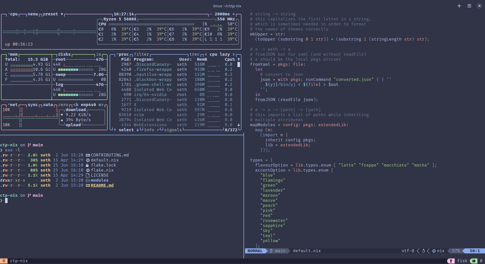
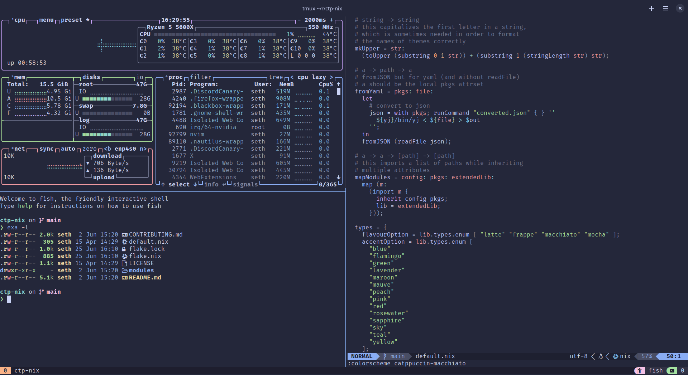
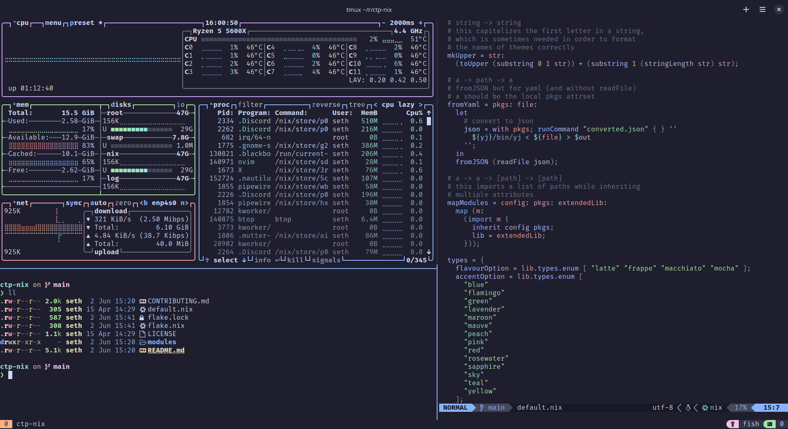

<h3 align="center">
	<br/>
	
	Catppuccin for <a href="https://nixos.org">Nix</a>
	
</h3>

<p align="center">
	<a href="https://github.com/catppuccin/nix/stargazers"></a>
	<a href="https://github.com/catppuccin/nix/issues"></a>
	<a href="https://github.com/catppuccin/nix/contributors"></a>
</p>

<p align="center">
	
</p>

## Previews

<details>
  <summary>🌻 Latte</summary>
  
</details>
<details>
  <summary>🪴 Frappé</summary>
  
</details>
<details>
  <summary>🌺 Macchiato</summary>
  
</details>
<details>
  <summary>🌿 Mocha</summary>
  
</details>

## Usage

You will probably want to see our [Getting started guide](http://nix.catppuccin.com/getting-started/index.html), but as a TLDR:

1. Import the [NixOS](https://nixos.org) and [home-manager](https://github.com/nix-community/home-manager) modules

<details>
<summary>With Flakes</summary>

```nix
{
  inputs = {
    nixpkgs.url = "nixpkgs/nixos-unstable";
    catppuccin.url = "github:catppuccin/nix";
    home-manager = {
      url = "github:nix-community/home-manager";
      inputs.nixpkgs.follows = "nixpkgs";
    };
  };

  outputs = { nixpkgs, catppuccin, home-manager }: {
    # for nixos module home-manager installations
    nixosConfigurations.pepperjacksComputer = pkgs.lib.nixosSystem {
      system = "x86_64-linux";
      modules = [
        catppuccin.nixosModules.catppuccin
        # if you use home-manager
        home-manager.nixosModules.home-manager

        {
          # if you use home-manager
          home-manager.users.pepperjack = {
            imports = [
              ./home.nix
              catppuccin.homeManagerModules.catppuccin
            ];
          };
        }
      ];
    };

    # for standalone home-manager installations
    homeConfigurations.pepperjack = home-manager.lib.homeManagerConfiguration {
      pkgs = nixpkgs.legacyPackages.x86_64-linux;
      modules = [
        ./home.nix
        catppuccin.homeManagerModules.catppuccin
      ];
    };
  };
}
```

</details>

<details>
<summary>With Nix Channels</summary>

```bash
sudo nix-channel --add https://github.com/nix-community/home-manager/archive/master.tar.gz home-manager
sudo nix-channel --add https://github.com/catppuccin/nix/archive/main.tar.gz catppuccin
sudo nix-channel --update
```

For [NixOS module installations](https://nix-community.github.io/home-manager/index.html#sec-install-nixos-module):

```nix
{
  imports = [
    <catppuccin/modules/nixos>
    # if you use home-manager
    <home-manager/nixos>
  ];

  # if you use home-manager
  home-manager.users.pepperjack = {
    imports = [
      <catppuccin/modules/home-manager>
    ];
  };
}

```

For [standalone installations](https://nix-community.github.io/home-manager/index.html#sec-install-standalone)

```nix
{
  imports = [
    <catppuccin/modules/home-manager>
  ];

  home.username = "pepperjack";
  programs.home-manager.enable = true;
}
```

</details>

2. Choose your desired flavor with `catppuccin.flavor`

```nix
{
  catppuccin.flavor = "mocha";
}
```

3. Enable for supported programs

```nix
{
  catppuccin.starship.enable = true;
}
```

4. Enable for all available programs you're using!

```nix
{
  catppuccin.enable = true;
}
```

## 🙋 FAQ

- Q: **"How do I know what programs are supported?"**\
  A: You can find programs supported through home-manager [here](https://nix.catppuccin.com/search/rolling/?scope=home-manager+modules),
  and NixOS modules [here](https://nix.catppuccin.com/search/rolling/?scope=NixOS+modules)

- Q: **"How do I set `catppuccin.enable` for everything I use?"**\
  A: You can set `catppuccin.enable` globally through home-manager [here](https://nix.catppuccin.com/search/rolling/?option_scope=1&option=catppuccin.enable),
  and NixOS modules [here](https://nix.catppuccin.com/search/rolling/?option_scope=0&option=catppuccin.enable)

- Q: **"What versions of NixOS and home-manager are supported?"**\
  A: We primarily support the `unstable` branch, but try our best to support the current stable release.
  You can check if your stable release is currently supported at [status.nixos.org](https://status.nixos.org/)

- Q: **"How do I fix the error: ... during evaluation because the option 'allow-import-from-derivation' is disabled"**\
  A: Some ports need to read and/or manipulate remote resources, resulting in Nix performing [IFD](https://nix.dev/manual/nix/latest/language/import-from-derivation).

  <details>
  <summary>Disable modules that use IFD</summary>
  
  ```nix
  {
    catppuccin = {
      cava.enable = false;
      gh-dash.enable = false;
      imv.enable = false;
      swaylock.enable = false;
      mako.enable = false;
    };
  }
  ```
  </details>

## 💝 Thanks to

- [Stonks3141](https://github.com/Stonks3141)
- [getchoo](https://github.com/getchoo)

&nbsp;

<p align="center">
	
</p>

<p align="center">
	Copyright &copy; 2023-present <a href="https://github.com/catppuccin" target="_blank">Catppuccin Org</a>
</p>

<p align="center">
	<a href="https://github.com/catppuccin/catppuccin/blob/main/LICENSE"></a>
</p>
